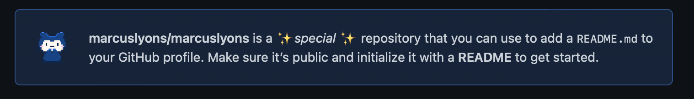

Creating a Profile README on GitHub can make your profile stand out from the
other developers out there.

This allows you to let a bit more of your personality show, as well as highlight
some of your interests in tech. Want to show off your CI skills? You could set
up a dynamic README that updates using GitHub Actions.

Unfortunately, it's been a few years since this feature was released.

## While it's documented for new users, existing users might have dismissed the notification to create a Profile README

Here's how, step by step:

### Create a repository in GitHub named the same as your username

As soon as you type this in you're greeted with a message that you're about to
create a _special_ repository.

### Select the Add a README file box

### Edit the README to customize your Profile

Here is where we can have some fun.

Want to add some icons showing the languages and tools you use?
[Shields.io can help with that](https://shields.io)

Want to add links to Twitter, TikTok, or Instagram? You can add markdown links
to the README.

Want to make it dynamic so it updates with the amount of repositories you have,
or stars? You could do this a number of ways, from
[open source projects](https://github.com/anuraghazra/github-readme-stats) to
creating an Action that will run on a schedule and query the GitHub API.

Hopefully this has given you an idea of how quickly we can set up a Profile
README, and make it our own.

For some more README inspiration I recommend checking out this repo of
[curated Profile READMES](https://github.com/abhisheknaiidu/awesome-github-profile-readm.e).
